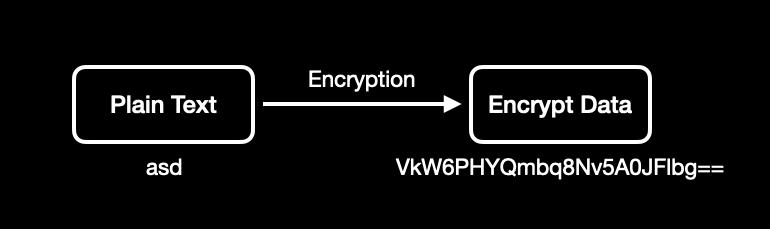
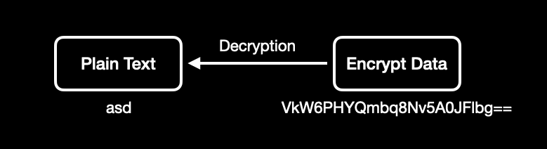
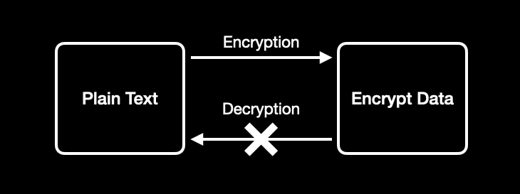
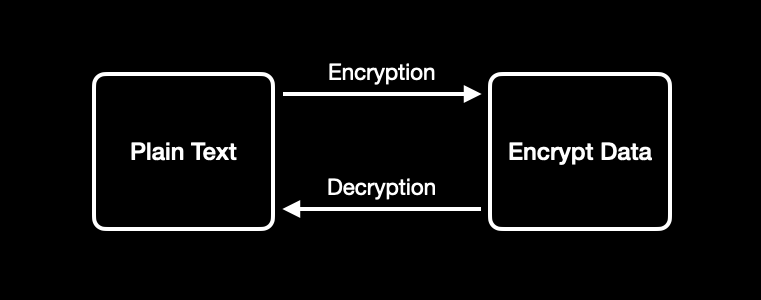
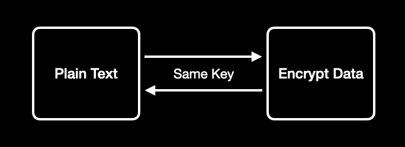

### 암호화 - Encryption

- 알고리즘을 이용하여 타인이 정보를 읽을 수 없도록 하는 것

 

### 복호화 - Decryption

- 암호화된 정보를 해독하는 것

 

### 단방향 암호화

- 암호화된 데이터에 대해 복호화가 불가능한 방식의 암호화
- 비밀번호 같은 평문으로 만들 필요가 없는 정보를 암호화할 때 사용

 

### 양방향 암호화

- 암호화된 데이터를 복호화할 수 있는 암호화
- 주소, 연락처, 이름 등의 보안상 암호화가 필요하지만 복호화하여 평문으로 제공할 필요가 있는 정보들을 암호화할 때 사용

 

### 대칭키 암호화

- 하나의 비밀키로 암호화 및 복호화하는 기법

 

### 공개키 암호화

- 암호화와 복호화에 사용하는 키가 서로 다른 기법
    - 암호화할 때에는 public key 를 사용
    - 복호화할 때에는 private key 를 사용
- public key 는 공개적으로 제공하여 사용자는 해당 키를 통해 암호화할 수 있지만 암호화한 데이터는 private key 를 가진 소유자만이 복호화할 수 있다.
